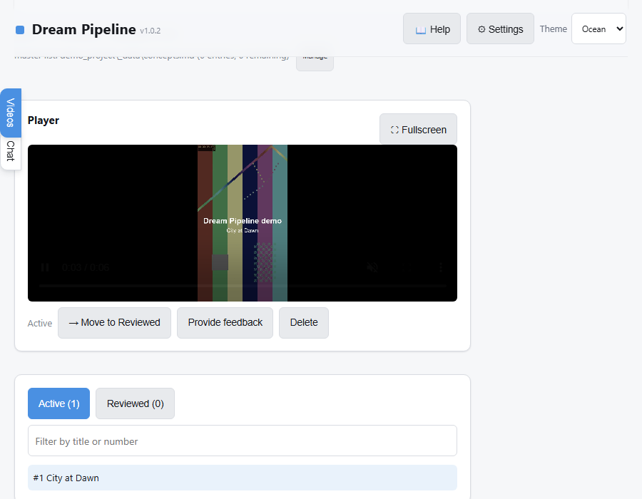
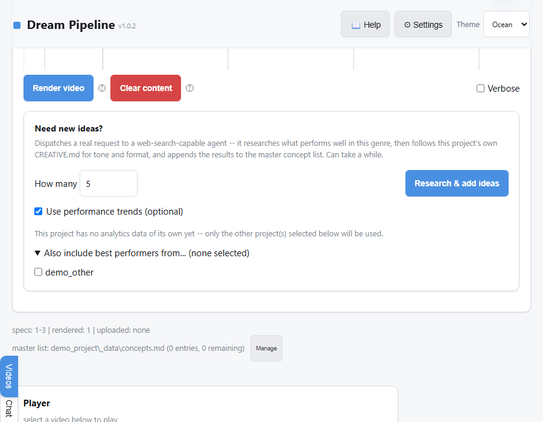

# Dream Pipeline

A batch automation layer for turning ideas into published videos at
scale, driven through a local web GUI. Dream Pipeline itself does no
rendering — it strictly orchestrates **ComfyUI** (running elsewhere,
local or remote) to do the actual video generation, and adds everything
around that:

- **Script/idea generation** — Ollama or Gemini drafts titles, premises,
  and full scripts (with a "research what performs well and suggest
  more ideas" mode), so a batch doesn't require hand-writing every concept.
- **Bulk video generation** — manage dozens of videos as rows in one
  table: edit content, queue keyframe + video renders, and track status
  across a whole batch instead of one video at a time.
- **YouTube uploads** — connect a channel, set a publish template, and
  schedule a batch to go out on a defined cadence instead of manually
  uploading each one.
- **Performance trend analysis** — pull real YouTube Analytics data back
  in (views, engagement, per-workflow/per-tag correlation) and get an
  AI-written review of what's actually working. Optionally feed that
  same performance data back into idea and script generation (see
  Performance trend mode below), so the next batch can build on it.

No auth — the trust model is "one user, reached only from `127.0.0.1`
or a private Docker network," never exposed to the open internet.

## Features

**Manage table** — edit every video's title, premise, prompts, tags, and
reference images in one grid. Bulk-select rows for AI content generation
or rendering, with per-row status at a glance.


**Creative Content Editor** — per-project genre, visual style, duration/
resolution, and the actual prompt template sent to the AI — not tied to
any particular subject or theme.


**Video review** — play each render (fullscreen supported, with its own
prev/next/move controls so review never has to drop back to the main
window), then Move to Reviewed, Delete, or **Provide feedback** — type
what didn't work and the AI revises the existing story/prompt (a real
edit, not a fresh unrelated rewrite) and reworks the render. Starts
immediately if nothing else is rendering, otherwise queues automatically
so review keeps going in the meantime — a status banner tracks progress
either way.



**YouTube upload & scheduling** — connect a channel, set a publish
template (privacy, tags, schedule cadence), and let the pipeline handle
timed releases.


**Performance trend mode (optional)** — feed real YouTube Analytics
data back into content generation, in two separate places:
- **Idea generation** — an explicit checkbox on the "Need new ideas?"
  card. Requires at least one project's Analytics to have been refreshed;
  optionally pull in top performers from other projects too, and the AI
  is explicitly encouraged to creatively merge two well-performing
  concepts into one new idea when it genuinely fits.
- **Spec/script generation** — a separate, off-by-default toggle in
  Settings that applies quietly to every AI-composed row. Framed
  strictly as style/tag signal that can never override a row's own
  locked concept, with a second sub-toggle for whether it goes as deep
  as pulling real script excerpts from still-local past renders.



**Settings** — live connection status for Ollama, ComfyUI, and Gemini,
with inline diagnostics for whatever's misconfigured.


## Quick start (Docker — recommended)

Two ways to run this, both via the same `docker-compose.yml`:

| | **Lite** (default) | **Complete** |
|---|---|---|
| What starts | Dream Pipeline only | Dream Pipeline + Ollama + ComfyUI, as sibling containers |
| Ollama/ComfyUI | Bring your own — local, remote, or a separate machine entirely | Bundled, running on **this same machine** |
| GPU requirement here | None — Dream Pipeline itself never touches a GPU | **Yes** — a real NVIDIA GPU on the machine running `docker compose`, see Hardware below |
| First-run downloads | None | Real model weights — several GB for the two default Ollama models alone |
| Command | `docker compose pull && docker compose up -d` | `./run_complete.sh` (Linux/macOS) or `run_complete.bat` (Windows) |

### Lite

```bash
docker compose pull
docker compose up -d
```

No build step — `docker-compose.yml` pulls a pre-built image from GHCR.
Then open **http://127.0.0.1:8420**.

The image is currently private, so the host running `docker compose pull`
needs to be logged in first (a one-time `docker login ghcr.io` using a
GitHub personal access token with `read:packages` scope).

`docker-compose.yml` mounts two volumes outside the repo:

| Volume | Container path | Contents |
|---|---|---|
| `DREAM_PIPELINE_DATA_DIR` (default `./data`) | `/data` | Every project's rendered videos, keyframes, specs, `index.json` |
| `DREAM_PIPELINE_STATE_DIR` (default `./state`) | `/state` | `config.json` + encrypted secrets (Gemini API key, YouTube OAuth) |

The defaults (`./data`, `./state` next to the compose file) work
out of the box for a quick try, but point them at real, backed-up storage
for an actual deployment — copy `.env.example` to `.env` and set both. Both
are created empty on first run either way — `entrypoint.sh` seeds a minimal
`config.json`, and everything else (backend URLs, model choices, YouTube
credentials) is set from the GUI's **Settings** screen, not by hand.

The host port defaults to `8420`; override with `WEB_UI_PORT=9000 docker
compose up` or the same `.env` file. It's bound to `127.0.0.1` on the host
deliberately — see the comment in `docker-compose.yml` before changing
that.

### Complete

```bash
./run_complete.sh     # Linux/macOS
run_complete.bat      # Windows
```

Equivalent to `docker compose --profile complete up -d` with
`OLLAMA_URL`/`COMFYUI_URL`/`CREATIVE_MODEL`/`VISION_MODEL` pre-set so
Dream Pipeline finds the bundled services automatically — Settings
shows both already configured, nothing to type in by hand. Adds four
containers (see `docker-compose.yml` for each one's own comments):

- **`ollama`** — the official `ollama/ollama` image (the same headless
  server Ollama Desktop wraps a GUI around — no desktop app is involved
  or needed).
- **`ollama-model-init`** — a one-shot container that pulls the two
  default models (`gemma4:12b` for creative writing, `qwen3-vl:8b` for
  vision QC — see **Tested models** below for why) once Ollama is up,
  then exits. Safe to leave running on every `docker compose up` —
  `ollama pull` is a no-op once a model's already present.
- **`comfyui`** — [`mmartial/comfyui-nvidia-docker`](https://github.com/mmartial/ComfyUI-Nvidia-Docker),
  a maintained, NVIDIA-CUDA-based community ComfyUI image.
- **`comfyui-model-init`** — a one-shot container that downloads the
  checkpoint + text encoder + vae/upscaler files our default workflow
  (`workflow_api_fml2v.json`) needs straight from Hugging Face into
  ComfyUI's `basedir` volume, then exits. Safe to re-run — skips
  already-downloaded files. Override `COMFYUI_CHECKPOINT_URL` /
  `COMFYUI_TEXT_ENCODER_URL` in `.env` to use a different
  `workflow_api_*.json`'s models instead (see `install_manifest.py` for
  each workflow's filenames/sources), and update Settings' workflow
  choice to match.

**Download size, first run only:** ~13.7GB for the two Ollama models
above, plus ~38GB for the default ComfyUI checkpoint set
(23GB diffusion model + 13.2GB text encoder + ~2GB vae/upscaler
companions) — **~52GB total**, before either service's own base image.
Nothing after this needs any manual model hunting for the default
workflow; `setup_installer.py` / Settings' dependency-check popup still
covers fetching a DIFFERENT workflow's models if you switch away from
the default.

**Why not bundled into Dream Pipeline's own image:** Ollama is MIT
licensed (fine to redistribute), but ComfyUI is GPL-3.0 and each
model (Ollama's or ComfyUI's) has its own separate license — rather
than sort out per-model redistribution terms, these are pulled
directly from their own publishers at deploy time (Docker Hub,
Ollama's own model registry, Hugging Face), never copied into an image
this repo controls.

#### Hardware & compatibility — read before running Complete

The Complete profile's GPU work (both Ollama and ComfyUI) runs **on
whatever machine actually runs `docker compose`** — unlike Lite, which
can point at Ollama/ComfyUI running anywhere on your network. If this
machine has no GPU, use Lite and point at a machine that does instead.

- **Requires a real NVIDIA GPU** on that machine, plus the
  [NVIDIA Container Toolkit](https://docs.nvidia.com/datacenter/cloud-native/container-toolkit/latest/install-guide.html)
  installed so Docker can actually reach it — a GPU driver alone isn't
  enough.
- **VRAM**: video generation is the heaviest consumer here; check
  whatever `workflow_api_*.json`/checkpoint you end up using for its
  own stated requirement rather than assuming a number — this varies a
  lot by workflow and this repo doesn't ship a fixed one.
- **Windows specifically**: Docker Desktop on Windows runs containers
  inside **WSL2** — a real lightweight Linux VM, not instruction-level
  emulation, but still a virtualization boundary GPU access has to
  cross. This needs its own WSL-aware NVIDIA driver on the Windows
  host (installed the normal way, but confirm it explicitly supports
  WSL2 GPU passthrough) and Docker Desktop's WSL2 backend with GPU
  support enabled — neither is automatic just from having Docker
  Desktop and a GPU installed. If GPU passthrough isn't working, the
  `ollama`/`comfyui` containers will start but silently run on CPU (or
  fail outright depending on the image) — verify with `docker compose
  exec ollama nvidia-smi` before assuming anything's using the GPU.

## Quick start (bare install, no Docker)

```bash
./run_dream_pipeline.sh   # Linux/macOS
run_dream_pipeline.bat    # Windows
```

First run bootstraps a Python venv under this machine's own per-user
app-data directory (never inside the repo — a venv bakes in absolute
paths, so one made on machine A won't run on machine B) and installs
`_pipeline/requirements.txt` into it. Every run after that launches
directly.

## Architecture

```
dreamPipeline/
  _pipeline/          the application — start with web_ui.py
  Dockerfile, docker-compose.yml, entrypoint.sh
  docker-publish.sh   maintainer-only: builds + pushes the image to GHCR
  run_dream_pipeline.{sh,bat}   bare-install launchers
```

Publishing a new image version (maintainers only — end users never build):

```bash
./docker-publish.sh          # pushes :latest
./docker-publish.sh v1.2.0   # pushes a versioned tag + updates :latest
```

Project data (one directory per channel) is **not**
part of this repo — it's runtime data mounted from outside (see the
volumes table above). Each project directory holds one subfolder per
rendered video, plus a `_data/` folder with that project's specs
(`spec_NNN.json`), `index.json` (row database), `CREATIVE.md`
(project-specific style facts), and YouTube credentials.

Inside `_pipeline/`:

| File | Role |
|---|---|
| `web_ui.py` | GUI server + route table — the primary entry point |
| `dream_step.py` | Core render-step engine, per-project config resolution |
| `generate_dream.py` | Spec → keyframe/video generation |
| `gemini_text.py` / `gemini_image.py` | Gemini model backends |
| `upload_dream.py` | YouTube publish flow (OAuth, scheduling, verify) |
| `youtube_analytics.py` | YouTube Analytics tab — channel stats, trend charts, AI review |
| `secret_store.py` | Fernet-encrypted secrets at rest |
| `setup_installer.py` / `install_manifest.py` | Dependency + model-file detection |
| `golden_rules_sections.json` | The fixed section structure (key/label/hint) every project's own `golden_rules.md` is drafted/edited against — see the Creative tab |

For AI-agent-facing architecture notes (skill routing, knowledge-file
conventions, lifecycle detail), see this repo's own `CLAUDE.md` if
present locally (kept out of the repo itself — development tooling, not
part of the distributable app), or ask an agent working in this repo to
read the source directly — `web_ui.py` and `dream_step.py` are the
ground truth.

## Requirements

- **A reachable ComfyUI instance, with model files installed for
  whatever workflow(s) you use — required.** Dream Pipeline does not
  render video itself; it's strictly an orchestration layer on top of
  ComfyUI's own API (checked live from Settings; no local GPU is needed
  for Dream Pipeline itself, it only ever talks to ComfyUI over HTTP).
- **Ollama and/or a Gemini API key — required for script/idea
  generation, vision QC, and concept research** (either one covers all
  three; a Gemini key also unlocks reference-image generation for
  keyframes that would otherwise need a local image model).
- **A Google Cloud OAuth client with the YouTube Data + Analytics APIs
  enabled — optional**, only needed for the Upload and Analytics tabs.
  Everything else works fully without it.

None of the above are hardcoded — `ollama_url`/`comfyui_url` are plain
config values, local or remote, set from Settings.

## Tested models

Ratings below are qualitative, from actually running each model against
real content in this pipeline — not a formal benchmark. **N/A** means it
hasn't been directly compared against an alternative for that role, not
that it's untested; blank/default means it's what's actually shipped as
this tool's own out-of-the-box choice.

| Backend | Use case | Model | Rating (1–10) | Notes |
|---|---|---|---|---|
| Ollama | Script/spec writing, chat, golden rules | `gemma4:12b` | 7 | Coherent, follows structured-JSON schemas reliably; the one confirmed weakness is tool-calling — sometimes describes an action in prose instead of actually invoking the tool (see `_ollama_tool_completion`'s own docs). Gemini is more reliable here if tool use matters more than cost. |
| Ollama | Script/spec writing (early default, since replaced) | `gemma4:E4B` | 3 | Technically schema-compliant but consistently weak/generic prose no matter how much prompt guidance it was given — the reason `creative_backend: gemini` was added as an alternative. |
| Ollama | Vision QC (reviewing rendered/generated images) | `qwen3-vl:8b` | 8 | Default `vision_model`. Consistent, specific species/detail identification. Needs `num_predict`/`num_ctx` headroom (see `VISION_OPTIONS`) — it's a "thinking" model whose reasoning trace silently eats the token budget on default Ollama settings, returning empty otherwise. |
| Ollama | Vision QC (alternative) | `minicpm-v` | 3 | Inconsistent — named a different animal per frame for the same actual images in side-by-side testing. |
| Ollama | Tool-calling (chat, concept research) | `minicpm` | N/A | Not a quality issue — genuinely incompatible. Returns a plain HTTP 400 the instant a request includes a `tools` param at all; falls back to plain chat automatically (see `_ollama_tool_completion`), but never gets real tool access with this model. |
| Gemini | Script/spec writing, chat | `gemini-flash-latest` | N/A | Default when `creative_backend: gemini`. Not directly graded against Ollama's models in this table, but was the fix for `gemma4:E4B`'s weak prose — noticeably stronger creative writing, at real per-call cost instead of free/local. |
| Gemini | Reference-image generation (keyframes) | `gemini-3.1-flash-image` | N/A | Only image-generation option currently wired in — no local alternative exists for this specific role (ComfyUI needs a *rendered* reference image as input, not text-to-image itself). |
| ComfyUI | Video/image rendering | *(your own checkpoint)* | N/A | Entirely your own installed checkpoint + `workflow_api_*.json` — this pipeline orchestrates ComfyUI's API but has no opinion on or comparative data across checkpoints. |

## Security notes

- Never commit `_pipeline/config.json`, anything under
  `_pipeline/gemini/` or `_pipeline/youtube/`, or any `*.enc` file — see
  `.gitignore`. `*.enc` files hold real credentials (Gemini API key,
  YouTube OAuth token) but Fernet-encrypted at rest, not plaintext;
  `config.json` holds local topology (URLs, model choices), which isn't
  secret but is still machine-specific. Both are regenerated per
  deployment, never shared.
- `secret_store.py`'s own docstring documents exactly what its
  encryption-at-rest does and doesn't protect against — read it before
  assuming a stronger threat model than intended.
