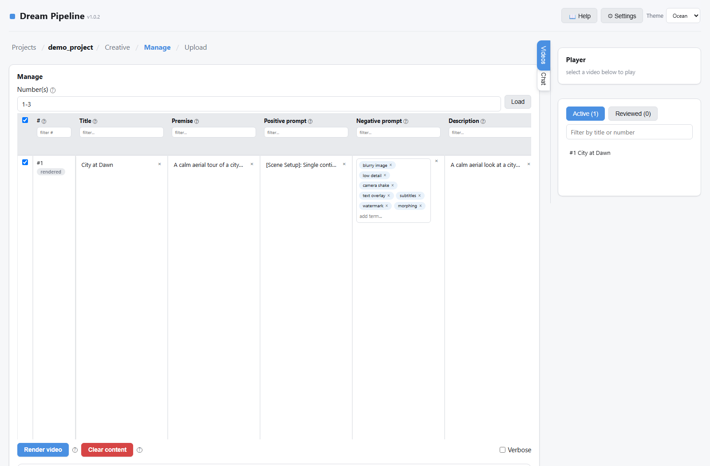
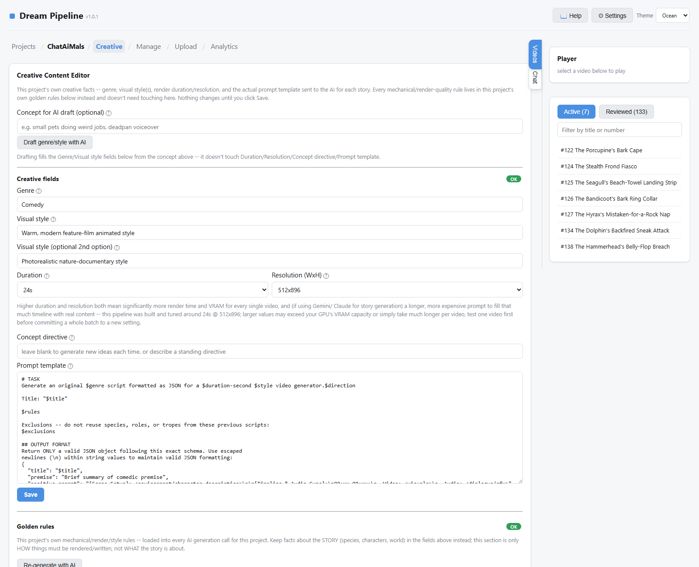
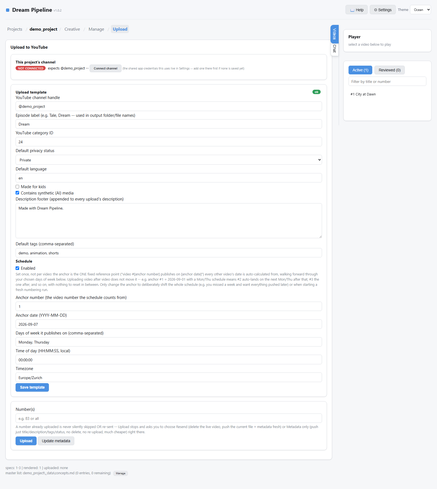
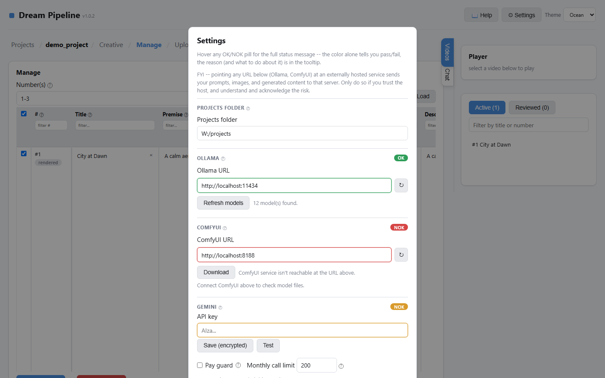

# Dream Pipeline

Local, single-user AI video pipeline. Generates short-form videos on
whatever subject you give it (script → keyframes → video clip → optional
YouTube upload) using local Ollama + ComfyUI plus the Gemini API, driven
through a local web GUI. No auth — the trust model is "one user, reached
only from `127.0.0.1` or a private Docker network," never exposed to the
open internet.

## Features

**Manage table** — edit every video's title, premise, prompts, tags, and
reference images in one grid. Bulk-select rows for AI content generation
or rendering, with per-row status at a glance.



**Creative Content Editor** — per-project genre, visual style, duration/
resolution, and the actual prompt template sent to the AI — not tied to
any particular subject or theme.



**YouTube upload & scheduling** — connect a channel, set a publish
template (privacy, tags, schedule cadence), and let the pipeline handle
timed releases.



**Settings** — live connection status for Ollama, ComfyUI, and Gemini,
with inline diagnostics for whatever's misconfigured.



## Quick start (Docker — recommended)

```bash
docker compose pull
docker compose up -d
```

No build step — `docker-compose.yml` pulls a pre-built image from GHCR.
Then open **http://127.0.0.1:8420**.

The image is currently private, so the host running `docker compose pull`
needs to be logged in first (a one-time `docker login ghcr.io` using a
GitHub personal access token with `read:packages` scope).

`docker-compose.yml` mounts two volumes outside the repo:

| Volume | Container path | Contents |
|---|---|---|
| `DREAM_PIPELINE_DATA_DIR` (default `./data`) | `/data` | Every project's rendered videos, keyframes, specs, `index.json` |
| `DREAM_PIPELINE_STATE_DIR` (default `./state`) | `/state` | `config.json` + encrypted secrets (Gemini API key, YouTube OAuth) |

The defaults (`./data`, `./state` next to the compose file) work
out of the box for a quick try, but point them at real, backed-up storage
for an actual deployment — copy `.env.example` to `.env` and set both. Both
are created empty on first run either way — `entrypoint.sh` seeds a minimal
`config.json`, and everything else (backend URLs, model choices, YouTube
credentials) is set from the GUI's **Settings** screen, not by hand.

The host port defaults to `8420`; override with `WEB_UI_PORT=9000 docker
compose up` or the same `.env` file. It's bound to `127.0.0.1` on the host
deliberately — see the comment in `docker-compose.yml` before changing
that.

## Quick start (bare install, no Docker)

```bash
./run_dream_pipeline.sh   # Linux/macOS
run_dream_pipeline.bat    # Windows
```

First run bootstraps a Python venv under this machine's own per-user
app-data directory (never inside the repo — a venv bakes in absolute
paths, so one made on machine A won't run on machine B) and installs
`_pipeline/requirements.txt` into it. Every run after that launches
directly.

## Architecture

```
dreamPipeline/
  _pipeline/          the application — start with web_ui.py
  Dockerfile, docker-compose.yml, entrypoint.sh
  docker-publish.sh   maintainer-only: builds + pushes the image to GHCR
  run_dream_pipeline.{sh,bat}   bare-install launchers
```

Publishing a new image version (maintainers only — end users never build):

```bash
./docker-publish.sh          # pushes :latest
./docker-publish.sh v1.2.0   # pushes a versioned tag + updates :latest
```

Project data (one directory per channel, e.g. `ChatAiMals/`) is **not**
part of this repo — it's runtime data mounted from outside (see the
volumes table above). Each project directory holds one subfolder per
rendered video, plus a `_data/` folder with that project's specs
(`spec_NNN.json`), `index.json` (row database), `CREATIVE.md`
(project-specific style facts), and YouTube credentials.

Inside `_pipeline/`:

| File | Role |
|---|---|
| `web_ui.py` | GUI server + route table — the primary entry point |
| `dream_step.py` | Core render-step engine, per-project config resolution |
| `generate_dream.py` | Spec → keyframe/video generation |
| `gemini_text.py` / `gemini_image.py` | Gemini model backends |
| `upload_dream.py` | YouTube publish flow (OAuth, scheduling, verify) |
| `youtube_analytics.py` | YouTube Analytics tab — channel stats, trend charts, AI review |
| `secret_store.py` | Fernet-encrypted secrets at rest |
| `setup_installer.py` / `install_manifest.py` | Dependency + model-file detection |
| `golden_rules.md` | House style/format guide for this project's own docs |

For AI-agent-facing architecture notes (skill routing, knowledge-file
conventions, lifecycle detail), see `_pipeline`'s own `CLAUDE.md` if
present, or ask an agent working in this repo to read the source
directly — `web_ui.py` and `dream_step.py` are the ground truth.

## Requirements

- A reachable Ollama instance and/or a Gemini API key (either covers
  Creative writing, Vision QC, and Concept research — see Settings)
- A reachable ComfyUI instance with the required model files (checked
  live from Settings; no local GPU needed for `dream-pipeline` itself,
  it only ever talks to ComfyUI over HTTP)
- Optional: a Google Cloud OAuth client + the YouTube Data/Analytics
  APIs enabled, for the Upload and Analytics tabs

None of the above are hardcoded — `ollama_url`/`comfyui_url` are plain
config values, local or remote, set from Settings.

## Security notes

- Never commit `_pipeline/config.json`, anything under
  `_pipeline/gemini/` or `_pipeline/youtube/`, or any `*.enc` file — see
  `.gitignore`. `*.enc` files hold real credentials (Gemini API key,
  YouTube OAuth token) but Fernet-encrypted at rest, not plaintext;
  `config.json` holds local topology (URLs, model choices), which isn't
  secret but is still machine-specific. Both are regenerated per
  deployment, never shared.
- `secret_store.py`'s own docstring documents exactly what its
  encryption-at-rest does and doesn't protect against — read it before
  assuming a stronger threat model than intended.
